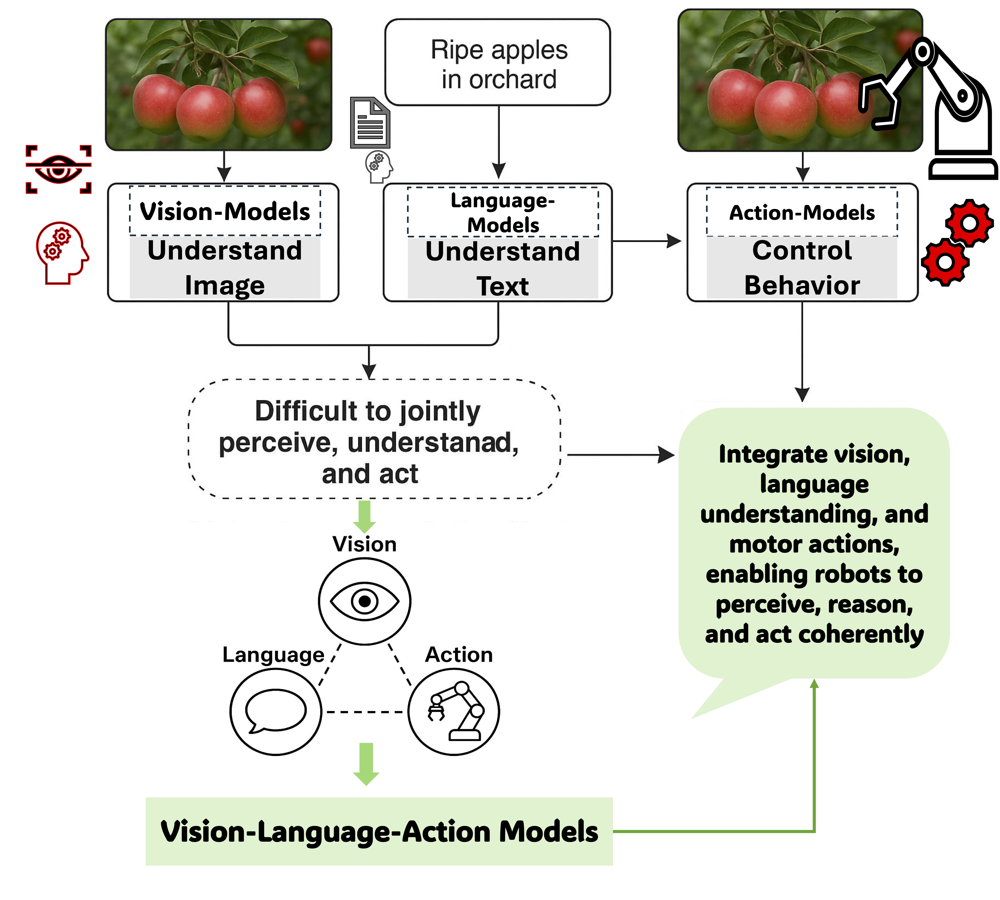

[](LICENSE)
[](https://arxiv.org/abs/2505.04769)

# Vision-Language-Action Models: Concepts, Progress, Applications and Challenges




## Abstract

Vision-Language-Action (VLA) models mark a transformative advancement in artificial intelligence, aiming to unify perception, natural language understanding, and embodied action within a single computational framework. This foundational review presents a comprehensive synthesis of recent advancements in Vision-Language-Action models, systematically organized across five thematic pillars that structure the landscape of this rapidly evolving field. We begin by establishing the conceptual foundations of VLA systems, tracing their evolution from cross-modal learning architectures to generalist agents that tightly integrate vision-language models (VLMs), action planners, and hierarchical controllers. Our methodology adopts a rigorous literature review framework, covering over 80 VLA models published in the past three years. Key progress areas include architectural innovations, parameter-efficient training strategies, and real-time inference accelerations. We explore diverse application domains such as humanoid robotics, autonomous vehicles, medical and industrial robotics, precision agriculture, and augmented reality navigation. The review further addresses major challenges across real-time control, multimodal action representation, system scalability, generalization to unseen tasks, and ethical deployment risks. Drawing from the state-of-the-art, we propose targeted solutions including agentic AI adaptation, cross-embodiment generalization, and unified neuro-symbolic planning. In our forward-looking discussion, we outline a future roadmap where VLA models, VLMs, and agentic AI converge to power socially aligned, adaptive, and general-purpose embodied agents. This work serves as a foundational reference for advancing intelligent, real-world robotics and artificial general intelligence. >Vision-language-action, Agentic AI, AI Agents, Vision-language Models

## Citation

If you find our work useful in your research, please consider citing:
```
@misc{sapkota2025visionlanguageactionmodelsconceptsprogress,
      title={Vision-Language-Action Models: Concepts, Progress, Applications and Challenges}, 
      author={Ranjan Sapkota and Yang Cao and Konstantinos I. Roumeliotis and Manoj Karkee},
      year={2025},
      eprint={2505.04769},
      archivePrefix={arXiv},
      primaryClass={cs.CV},
      url={https://arxiv.org/abs/2505.04769}, 
}
```

## Contents

- [Paper List](#paper-list)
  - [Seminal Papers](#seminal-papers)
  - [Follow-up Papers](#follow-up-papers)
    - [2026](Paper_List/paper_list_2026.md)
    - [2025](Paper_List/paper_list_2025.md)
    - [2024](Paper_List/paper_list_2024.md)
    - [2023](Paper_List/paper_list_2023.md)
    - [2022](Paper_List/paper_list_2022.md)
    - [2021](Paper_List/paper_list_2021.md)
    - [2020](Paper_List/paper_list_2020.md)
    - [2019](Paper_List/paper_list_2019.md)
    - [2018](Paper_List/paper_list_2018.md)
    - [2017](Paper_List/paper_list_2017.md)
    - [2016](Paper_List/paper_list_2016.md)
    - [2015](Paper_List/paper_list_2015.md)
    - [2014](Paper_List/paper_list_2014.md)
    - [2011](Paper_List/paper_list_2011.md)
    - [2010](Paper_List/paper_list_2010.md)

## Paper List

### Seminal Papers

add some seminal paper of those in mds here

### Follow-up Papers
- [2026](Paper_List/paper_list_2026.md)
- [2025](Paper_List/paper_list_2025.md)
- [2024](Paper_List/paper_list_2024.md)
- [2023](Paper_List/paper_list_2023.md)
- [2022](Paper_List/paper_list_2022.md)
- [2021](Paper_List/paper_list_2021.md)
- [2020](Paper_List/paper_list_2020.md)
- [2019](Paper_List/paper_list_2019.md)
- [2018](Paper_List/paper_list_2018.md)
- [2017](Paper_List/paper_list_2017.md)
- [2016](Paper_List/paper_list_2016.md)
- [2015](Paper_List/paper_list_2015.md)
- [2014](Paper_List/paper_list_2014.md)
- [2011](Paper_List/paper_list_2011.md)
- [2010](Paper_List/paper_list_2010.md)

